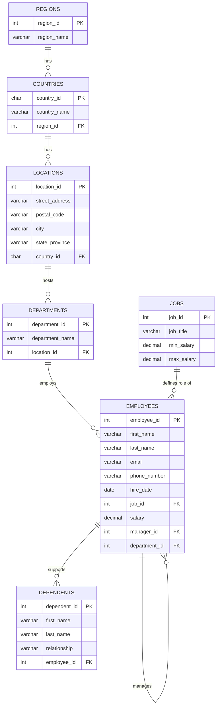

# The `office` Schema

Everything in this course runs against this schema. Learn the shape of it once, and every
query afterwards becomes obvious — a join is just "walk one arrow in this diagram".

## The diagram



## Reading the relationships

The `*` in the diagram marks the **primary key** — the column that uniquely identifies a row.
A column that points at another table's primary key is a **foreign key**.

| From | To | Via | Meaning |
|---|---|---|---|
| `employees` | `jobs` | `employees.job_id` | Every employee holds one job title |
| `employees` | `departments` | `employees.department_id` | Every employee sits in one department |
| `employees` | `employees` | `employees.manager_id` | An employee's manager **is another employee** (self-join) |
| `dependents` | `employees` | `dependents.employee_id` | A dependent belongs to one employee |
| `departments` | `locations` | `departments.location_id` | A department sits at one physical location |
| `locations` | `countries` | `locations.country_id` | A location is in one country |
| `countries` | `regions` | `countries.region_id` | A country belongs to one region |

## The one chain that matters

Notice there is **no direct link from an employee to a region**. To answer "which region does
this employee work in?" you have to walk the whole chain:

```
employees → departments → locations → countries → regions
```

That single fact is the reason multi-table joins exist, and it is exactly what we build in
[`08_multi_table_joins.sql`](../05-joins/08_multi_table_joins.sql).

## The `shop` database

A separate, deliberately tiny database used to introduce joins before the complexity of `office`:

| Table | Columns |
|---|---|
| `personas` | `person_id` (PK), `name`, `age` |
| `orders` | `order_id` (PK), `order_number`, `person_id` (FK → `personas`) |

One person can place many orders. That's the whole thing.
