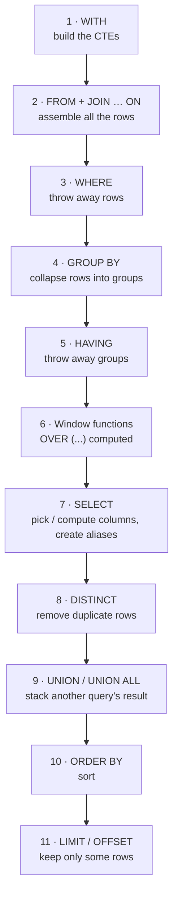

# Clause Order — how a query is written vs how it runs

Every SQL query has **two** orders:

1. **Written order** — the order MySQL forces you to type the clauses in. Get it wrong and you get a syntax error.
2. **Execution order** — the order MySQL actually *runs* them in. This explains almost every "unknown column" and "invalid use of group function" error you'll ever see.

They are not the same. `SELECT` is written first but runs almost **last**.

---

## 1. The full `SELECT` statement — written order

Every clause except `SELECT` is optional, but the ones you use must appear in exactly this order:

```sql
WITH       cte_name AS (...)          -- 1. named subqueries (CTEs)
SELECT     DISTINCT col, AGG(col),    -- 2. which columns to return
           fn() OVER (...)            --    (window functions live here)
FROM       table_a a                  -- 3. where the rows come from
JOIN       table_b b ON a.id = b.id   -- 4. combine tables
WHERE      condition                  -- 5. filter ROWS
GROUP BY   col                        -- 6. collapse rows into groups
HAVING     AGG(col) condition         -- 7. filter GROUPS
WINDOW     w AS (...)                 -- 8. named windows (rarely used)
ORDER BY   col                        -- 9. sort
LIMIT      n OFFSET m;                -- 10. keep only some rows
```

A quick way to remember the core six:

> **S**ome **F**riends **W**ant **G**ood **H**ot **O**melettes
> — `SELECT` `FROM` `WHERE` `GROUP BY` `HAVING` `ORDER BY`

---

## 2. Execution order — what MySQL actually does



| Step | Clause | What it does | Rows going in → coming out |
|---|---|---|---|
| 1 | `WITH` | Builds each CTE so the rest of the query can use it like a table | — |
| 2 | `FROM` / `JOIN … ON` | Reads the tables and glues them together | tables → one big row set |
| 3 | `WHERE` | Keeps only rows that match the condition | many → fewer **rows** |
| 4 | `GROUP BY` | Collapses rows sharing the same value into one group each | rows → **groups** |
| 5 | `HAVING` | Keeps only groups that match the condition | groups → fewer groups |
| 6 | Window functions | Computes `RANK()`, `SUM() OVER (...)` etc. on what's left | same count (adds a column) |
| 7 | `SELECT` | Computes the output columns and **creates the aliases** | same count |
| 8 | `DISTINCT` | Removes duplicate output rows | → fewer rows |
| 9 | `UNION` | Stacks the result of another `SELECT` underneath | → more rows |
| 10 | `ORDER BY` | Sorts the final rows | same count |
| 11 | `LIMIT` / `OFFSET` | Skips `OFFSET` rows, then keeps `LIMIT` rows | → at most *n* rows |

---

## 3. What each clause can "see"

A clause can only use things that already exist when it runs. This one table explains most errors:

| Clause | Table columns | Aggregates (`COUNT`, `SUM`…) | `SELECT` aliases | Window functions |
|---|---|---|---|---|
| `WHERE` | ✅ | ❌ not computed yet | ❌ not created yet | ❌ |
| `GROUP BY` | ✅ | ❌ | ✅ *MySQL only* | ❌ |
| `HAVING` | ✅ grouped ones | ✅ | ✅ *MySQL only* | ❌ |
| `SELECT` | ✅ | ✅ | ❌ (not its own) | ✅ |
| `ORDER BY` | ✅ | ✅ | ✅ | ✅ |

> *MySQL only*: MySQL lets you use a `SELECT` alias in `GROUP BY` and `HAVING` as a convenience. Standard SQL (and PostgreSQL / SQL Server) does not — repeat the expression there if you want portable SQL.

---

## 4. The errors execution order explains

| You wrote | Error | Why (execution order) | Fix |
|---|---|---|---|
| `SELECT salary * 12 AS annual … WHERE annual > 100000` | Unknown column `annual` | `WHERE` (3) runs before `SELECT` (7) creates the alias | `WHERE salary * 12 > 100000` |
| `WHERE COUNT(*) > 5` | Invalid use of group function | `WHERE` (3) runs before `GROUP BY` (4) — no groups to count yet | Move it to `HAVING COUNT(*) > 5` |
| `WHERE ranks = 1` on a `RANK() … AS ranks` | Unknown column `ranks` | Window functions (6) run after `WHERE` (3) | Wrap in a derived table, filter outside (lesson 23) |
| `HAVING salary > 5000` with no aggregate | Works, but slow and misleading | Filters **after** grouping what could be filtered before | Use `WHERE salary > 5000` |
| `SELECT first_name, COUNT(*) … GROUP BY department_id` | `ONLY_FULL_GROUP_BY` error | After grouping (4), one group has many `first_name`s — which one? | Group by it, or aggregate it |
| `ORDER BY annual` | ✅ Works | `ORDER BY` (10) runs after `SELECT` (7) — the alias exists | — |
| `LIMIT 5` with no `ORDER BY` | ✅ Runs, but random "top 5" | `LIMIT` (11) just takes whatever comes first | Always `ORDER BY` before `LIMIT` |

---

## 5. `WHERE` vs `HAVING` — side by side

```sql
SELECT   department_id, COUNT(*) AS headcount
FROM     employees
WHERE    salary > 5000          -- ① drop ROWS: only employees earning > 5000
GROUP BY department_id          -- ② group what's left
HAVING   COUNT(*) > 3           -- ③ drop GROUPS: only departments with > 3 of them
ORDER BY headcount DESC;        -- ④ sort (alias is fine here)
```

|  | `WHERE` | `HAVING` |
|---|---|---|
| Runs | before `GROUP BY` | after `GROUP BY` |
| Filters | individual rows | whole groups |
| Can use aggregates? | ❌ | ✅ |
| Rule of thumb | condition on a **column** | condition on an **aggregate** |

---

## 6. Joins inside `FROM`

`JOIN`s are part of step 2. They run in the order written, left to right, each one adding to the row set built so far:

```sql
FROM employees e                                        -- start with employees
JOIN departments d ON d.department_id = e.department_id -- + department
JOIN locations   l ON l.location_id   = d.location_id   -- + location
LEFT JOIN dependents dp ON dp.employee_id = e.employee_id
```

- `ON` decides **how rows match** while joining.
- `WHERE` filters **after** all joins are done.
- ⚠️ With a `LEFT JOIN`, a condition on the right-hand table behaves differently in `ON` vs `WHERE`:

```sql
-- Keeps every employee; only attaches 'Child' dependents
LEFT JOIN dependents dp ON dp.employee_id = e.employee_id AND dp.relationship = 'Child'

-- Drops employees with no 'Child' dependent — turns it into an INNER JOIN
LEFT JOIN dependents dp ON dp.employee_id = e.employee_id
WHERE dp.relationship = 'Child'
```

---

## 7. Subqueries, CTEs and `UNION`

**Subqueries** run as their own complete query, with their own clause order, and hand back their result:

```sql
SELECT *
FROM employees
WHERE salary > (SELECT AVG(salary) FROM employees);   -- inner query runs first
```

**Derived tables** run first and become the "table" in `FROM`:

```sql
SELECT *
FROM ( SELECT ..., RANK() OVER (...) AS r FROM employees ) dt   -- runs first
WHERE dt.r = 1;                                                 -- now r exists
```

**CTEs** are written first and built first:

```sql
WITH dept_avg AS (
    SELECT department_id, AVG(salary) AS avg_sal
    FROM employees
    GROUP BY department_id
)
SELECT * FROM dept_avg WHERE avg_sal > 8000;
```

**`UNION`** — each `SELECT` keeps its own `WHERE`/`GROUP BY`/`HAVING`. `ORDER BY` and `LIMIT` go **once, at the very end**, and apply to the combined result:

```sql
SELECT first_name FROM employees  WHERE department_id = 9
UNION ALL
SELECT first_name FROM dependents WHERE relationship = 'Child'
ORDER BY first_name
LIMIT 10;
```

---

## 8. Clause order in the other statements

### `INSERT`

```sql
INSERT INTO table_name (col1, col2)
VALUES (v1, v2), (v3, v4);

INSERT INTO table_name (col1, col2)       -- or copy rows from a query
SELECT a, b FROM other_table WHERE ...;
```

### `UPDATE`

```sql
UPDATE   employees
SET      salary = salary + 1000
WHERE    department_id = 6
ORDER BY salary           -- optional
LIMIT    5;               -- optional
```

With a `JOIN` (MySQL) — but then `ORDER BY` and `LIMIT` are **not allowed**:

```sql
UPDATE employees e
JOIN   departments d ON d.department_id = e.department_id
SET    e.salary = e.salary + 1000
WHERE  d.department_name = 'IT';
```

Runs as: `UPDATE`/`JOIN` (find the rows' source) → `WHERE` (pick rows) → `ORDER BY` → `LIMIT` → `SET` (change them).

### `DELETE`

```sql
DELETE FROM employees
WHERE    employee_id = 207
ORDER BY hire_date        -- optional
LIMIT    1;               -- optional
```

> 🚨 For `UPDATE` and `DELETE`, **`WHERE` is the whole safety net.** Run the same `WHERE` in a `SELECT` first.

### `CREATE TABLE`

```sql
CREATE TABLE enrollments (
    student_id  INT          NOT NULL,       -- column, type, constraints
    course_id   INT          NOT NULL,
    enrolled_on DATE         DEFAULT (CURDATE()),
    PRIMARY KEY (student_id, course_id),     -- table-level constraints last
    FOREIGN KEY (student_id) REFERENCES students(student_id)
);
```

### Transactions

```sql
START TRANSACTION;
    UPDATE ...;
    SAVEPOINT before_second;
    UPDATE ...;
    ROLLBACK TO SAVEPOINT before_second;   -- optional
COMMIT;                                    -- or ROLLBACK;
```

---

## 9. One query using (almost) everything

Read the numbers in the comments — that's the execution order.

```sql
WITH region_emps AS (                                         -- 1
    SELECT e.employee_id, e.salary, e.department_id, r.region_name
    FROM employees e
    JOIN departments d ON d.department_id = e.department_id
    JOIN locations   l ON l.location_id   = d.location_id
    JOIN countries   c ON c.country_id    = l.country_id
    JOIN regions     r ON r.region_id     = c.region_id
)
SELECT   re.region_name,                                      -- 7
         d.department_name,
         COUNT(*)                                AS headcount,
         ROUND(AVG(re.salary), 2)                AS avg_salary,
         RANK() OVER (ORDER BY AVG(re.salary) DESC) AS pay_rank -- 6
FROM     region_emps re                                       -- 2
JOIN     departments d ON d.department_id = re.department_id  -- 2
WHERE    re.salary > 3000                                     -- 3
GROUP BY re.region_name, d.department_id, d.department_name   -- 4
HAVING   COUNT(*) >= 2                                        -- 5
ORDER BY pay_rank                                             -- 10
LIMIT    5;                                                   -- 11
```

---

## 10. Checklist before you run a query

1. Is every clause in the **written** order? (`WHERE` before `GROUP BY`, `HAVING` after it, `ORDER BY` near the end, `LIMIT` last)
2. Does `WHERE` use only real table columns — no aliases, no aggregates, no window functions?
3. Is every non-aggregated column in `SELECT` also in `GROUP BY`?
4. Is the aggregate condition in `HAVING`, not `WHERE`?
5. If there's a `LIMIT`, is there an `ORDER BY` too?
6. Need to filter on a window function? Wrap the query and filter outside.

See also: [`cheatsheet.md`](cheatsheet.md) for a one-page recap of every topic.
